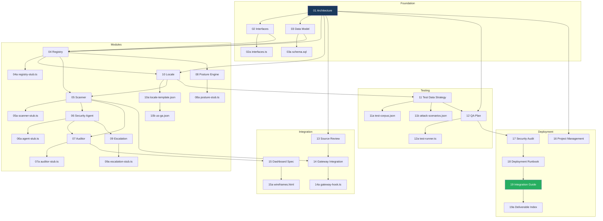

# Security Watchdog - Deliverable Index

**Document ID:** SWDOG-INDEX-019  
**Version:** 1.0 DRAFT  
**Date:** February 2026  
**Classification:** INTERNAL

---

## Overview

This document provides a complete index of all deliverables in the OpenClaw Security Watchdog project. Use this as the master reference for locating documentation, code artifacts, and configuration files.

### Status Legend

| Status | Meaning |
|--------|---------|
| ✅ Complete | Deliverable is finalized and approved |
| 🔄 In Review | Deliverable is awaiting review/approval |
| 🚧 In Progress | Deliverable is being developed |
| ⏳ Not Started | Deliverable is planned but not begun |
| ❌ Blocked | Deliverable is waiting on dependencies |

### Audience Legend

| Code | Audience |
|------|----------|
| **SA** | Solution Architect |
| **DEV** | Developer |
| **QA** | Quality Assurance |
| **SEC** | Security Auditor |
| **OPS** | Operations/DevOps |

---

## Phase 1: Foundation Documents

### Architecture & Design

| Doc # | Document Name | File Name | Description | Status | Dependencies | Audience |
|-------|---------------|-----------|-------------|--------|--------------|----------|
| 01 | Solution Architecture Overview | `01-solution-architecture-overview.docx` | Master architecture document covering system context, four-layer design, ADRs, and deployment topology | 🔄 | None | SA, DEV, SEC |
| 02 | Interface Contracts | `02-interface-contracts.docx` | Complete API specifications for all inter-component communication (IF-001 through IF-010) | 🔄 | 01 | SA, DEV |
| 02a | Interface Type Definitions | `02-interfaces.ts` | TypeScript type definitions for all interface contracts; published as @watchdog/types | 🔄 | 02 | DEV |
| 03 | Data Model & Database Schema | `03-data-model-database-schema.docx` | Entity-relationship diagrams, table specifications, and indexing strategy for SQLite registry | 🔄 | 01, 02 | SA, DEV |
| 03a | Database Schema Script | `03-schema.sql` | SQL DDL for creating all database tables, indexes, and triggers | 🔄 | 03 | DEV, OPS |

---

## Phase 2: Module Specifications

### Layer 0: Foundation

| Doc # | Document Name | File Name | Description | Status | Dependencies | Audience |
|-------|---------------|-----------|-------------|--------|--------------|----------|
| 04 | Module: Sensitive Data Registry | `04-module-registry.docx` | Full specification for Layer 0 Registry including CRUD operations, CLI commands, and caching | 🔄 | 01, 02, 03 | DEV |
| 04a | Registry Implementation Stub | `04-registry-stub.ts` | TypeScript implementation skeleton with TODO markers for all Registry functions | 🔄 | 02a, 04 | DEV |
| 10 | Module: Locale Framework | `10-module-locale.docx` | Jurisdiction-aware PII detection patterns, compliance rules, and locale management | 🔄 | 01, 02, 04 | DEV |
| 10a | Locale Template | `locales/10-locale-template.json` | JSON template for creating new locale definitions with schema annotations | 🔄 | 10 | DEV |
| 10b | US-GA Locale Definition | `locales/10-locale-us-ga.json` | Complete United States - Georgia locale with 19 PII patterns and compliance mappings | 🔄 | 10, 10a | DEV, OPS |

### Layer 1: Pattern Scanner

| Doc # | Document Name | File Name | Description | Status | Dependencies | Audience |
|-------|---------------|-----------|-------------|--------|--------------|----------|
| 05 | Module: Pattern Scanner | `05-module-scanner.docx` | Deterministic first-pass scanner using Presidio, detect-secrets, and fuse.js | 🔄 | 01, 02, 04, 10 | DEV |
| 05a | Scanner Implementation Stub | `05-scanner-stub.ts` | TypeScript implementation skeleton for all Scanner pipeline stages | 🔄 | 02a, 05 | DEV |

### Layer 2: Security Agent

| Doc # | Document Name | File Name | Description | Status | Dependencies | Audience |
|-------|---------------|-----------|-------------|--------|--------------|----------|
| 06 | Module: Security Agent | `06-module-security-agent.docx` | AI-powered contextual classification using Ollama with prompt injection hardening | 🔄 | 01, 02, 05 | DEV, SEC |
| 06a | Security Agent Implementation Stub | `06-security-agent-stub.ts` | TypeScript implementation skeleton for Agent classification pipeline | 🔄 | 02a, 06 | DEV |

### Layer 3: Auditor

| Doc # | Document Name | File Name | Description | Status | Dependencies | Audience |
|-------|---------------|-----------|-------------|--------|--------------|----------|
| 07 | Module: Auditor Daemon | `07-module-auditor.docx` | Health monitoring, workspace scanning, metrics aggregation, and system mode management | 🔄 | 01, 02, 04, 05, 06 | DEV, OPS |
| 07a | Auditor Implementation Stub | `07-auditor-stub.ts` | TypeScript implementation skeleton for Auditor daemon services | 🔄 | 02a, 07 | DEV |

### Cross-Cutting Components

| Doc # | Document Name | File Name | Description | Status | Dependencies | Audience |
|-------|---------------|-----------|-------------|--------|--------------|----------|
| 08 | Module: Dynamic Posture Engine | `08-module-posture.docx` | Real-time security posture calculation based on inventory risk assessment | 🔄 | 01, 02, 04 | DEV |
| 08a | Posture Engine Implementation Stub | `08-posture-stub.ts` | TypeScript implementation skeleton for Posture calculation and history | 🔄 | 02a, 08 | DEV |
| 09 | Module: Human Escalation Interface | `09-module-escalation.docx` | Async approval workflow via messaging channels with registry learning | 🔄 | 01, 02, 06 | DEV |
| 09a | Escalation Implementation Stub | `09-escalation-stub.ts` | TypeScript implementation skeleton for escalation lifecycle management | 🔄 | 02a, 09 | DEV |

---

## Phase 3: Integration & Gateway

| Doc # | Document Name | File Name | Description | Status | Dependencies | Audience |
|-------|---------------|-----------|-------------|--------|--------------|----------|
| 13 | Source Code Review | `13-source-code-review.docx` | Analysis of OpenClaw source code for hook integration points and channel adapters | 🔄 | 01 | SA, DEV |
| 14 | Gateway Integration Guide | `14-gateway-integration.docx` | How to install the watchdog as an OpenClaw hook with configuration reference | 🔄 | 01, 05, 13 | DEV, OPS |
| 14a | Gateway Hook Implementation | `14-gateway-hook.ts` | TypeScript implementation stub for OpenClaw gateway hook handler | 🔄 | 02a, 05a, 14 | DEV |

---

## Phase 4: Dashboard & Visualization

| Doc # | Document Name | File Name | Description | Status | Dependencies | Audience |
|-------|---------------|-----------|-------------|--------|--------------|----------|
| 15 | Executive Dashboard Specification | `15-dashboard-spec.docx` | Dashboard requirements, API endpoints, and component specifications | 🔄 | 01, 02, 07 | DEV |
| 15a | Dashboard Wireframes | `15-dashboard-wireframes.html` | Interactive HTML/CSS wireframes for all dashboard views | 🔄 | 15 | DEV, SA |

---

## Phase 5: Testing & Quality Assurance

| Doc # | Document Name | File Name | Description | Status | Dependencies | Audience |
|-------|---------------|-----------|-------------|--------|--------------|----------|
| 11 | Test Data Strategy | `11-test-data-strategy.docx` | Approach for generating synthetic PII test data without using real personal information | 🔄 | 10 | QA, DEV |
| 11a | Test Corpus | `11-test-corpus.json` | Labeled synthetic PII samples organized by category, difficulty, and expected outcomes | 🔄 | 11 | QA, DEV |
| 11b | Attack Scenarios | `11-attack-scenarios.json` | 18 structured E2E test scenarios covering breach patterns and edge cases | 🔄 | 01, 11 | QA, SEC |
| 12 | Quality Assurance Plan | `12-qa-plan.docx` | Comprehensive testing strategy covering unit, integration, E2E, performance, and security tests | 🔄 | All modules | QA, SA |
| 12a | Test Runner Configuration | `12-test-runner.ts` | Vitest configuration and test harness setup for all test levels | 🔄 | 12 | QA, DEV |

---

## Phase 6: Security Audit

| Doc # | Document Name | File Name | Description | Status | Dependencies | Audience |
|-------|---------------|-----------|-------------|--------|--------------|----------|
| 17 | Security Audit Framework | `17-security-audit.docx` | STRIDE threat model, NIST 800-53 controls mapping, penetration test plan, and audit procedures | 🔄 | 01, 12 | SEC, SA |

---

## Phase 7: Operations & Deployment

| Doc # | Document Name | File Name | Description | Status | Dependencies | Audience |
|-------|---------------|-----------|-------------|--------|--------------|----------|
| 16 | Project Management Artifacts | `16-project-management-artifacts.docx` | WBS, risk register, RACI matrix, dependency map, and outsourcing guidelines | 🔄 | 01 | SA, PM |
| 18 | Deployment Runbook | `18-deployment-runbook.docx` | Step-by-step installation, configuration, troubleshooting, and operational procedures | 🔄 | All modules | OPS |
| 19 | Integration Guide | `19-integration-guide.docx` | Module assembly sequence, integration tests, smoke tests, and system validation | 🔄 | All modules | DEV, QA, OPS |
| 19a | Deliverable Index | `19-deliverable-index.md` | This document - master index of all project deliverables | 🔄 | All | All |

---

## Supporting Artifacts

### Configuration & Constants

| File Name | Description | Status | Dependencies | Audience |
|-----------|-------------|--------|--------------|----------|
| `config.ts` | Configuration loading and validation logic | 🔄 | 02a | DEV |
| `constants.ts` | System-wide constants (limits, timeouts, defaults) | 🔄 | None | DEV |
| `default.json` | Default configuration file template | 🔄 | constants.ts | DEV, OPS |
| `schema.json` | JSON Schema for configuration validation | 🔄 | default.json | DEV |
| `errors.ts` | Error code definitions and error classes | 🔄 | None | DEV |
| `types.ts` | Shared TypeScript type definitions | 🔄 | None | DEV |

### Build & Development

| File Name | Description | Status | Dependencies | Audience |
|-----------|-------------|--------|--------------|----------|
| `package.json` | Node.js package manifest with dependencies and scripts | 🔄 | None | DEV |
| `tsconfig.json` | TypeScript compiler configuration | 🔄 | None | DEV |
| `setup.sh` | First-time setup script for development environment | 🔄 | None | DEV, OPS |
| `seed-db.sh` | Database seeding script for development/testing | 🔄 | 03a | DEV, QA |

### Documentation

| File Name | Description | Status | Dependencies | Audience |
|-----------|-------------|--------|--------------|----------|
| `README.md` | Project overview and quick-start guide | 🔄 | 01 | All |
| `watchdog-project-playbook.md` | Complete prompt sequence for generating all deliverables | 🔄 | None | SA |
| `architecture-summary.txt` | Condensed architecture reference from design conversations | 🔄 | 01 | SA |

### Hooks & Plugins

| File Name | Description | Status | Dependencies | Audience |
|-----------|-------------|--------|--------------|----------|
| `hooks.ts` | Hook registration utilities | 🔄 | 02a | DEV |
| `plugin-hooks.ts` | Plugin hook interface definitions | 🔄 | hooks.ts | DEV |
| `loader.ts` | Dynamic module loading utilities | 🔄 | None | DEV |
| `workspace.ts` | Workspace management utilities | 🔄 | None | DEV |
| `install.ts` | Installation and setup logic | 🔄 | None | DEV |

---

## Dependency Graph

The following diagram shows the dependencies between major deliverables:

---

## Document Conventions

### Versioning

All documents follow semantic versioning within the project:

- **DRAFT**: Document is in active development
- **1.0**: First approved release
- **1.x**: Minor updates that don't change interfaces
- **2.0**: Major updates with breaking changes

### File Naming

- **Word Documents (.docx)**: `NN-document-name.docx` where NN is the document number
- **TypeScript Stubs (.ts)**: `NNa-component-stub.ts` matching the parent specification
- **JSON Config (.json)**: `NNa-description.json` or `NNb-description.json` for variants
- **SQL Scripts (.sql)**: `NNa-schema.sql` or `NNa-migration.sql`
- **Markdown (.md)**: `NNa-readme.md` for developer documentation

### Cross-References

Documents reference each other using the format:

- **Document**: `SWDOG-MOD-004` (module registry specification)
- **Interface**: `IF-001` (gateway to scanner outbound intercept)
- **Requirement**: `FR-004-001` (Registry functional requirement 1)
- **Test Case**: `UT-004-001` (Registry unit test 1)

---

## Change Log

| Version | Date | Author | Changes |
|---------|------|--------|---------|
| 1.0 | February 2026 | Solution Architect | Initial release: complete deliverable index for all project artifacts |

---

## Contact

For questions about this index or any deliverable:

- **Solution Architect**: Responsible for architecture documents (01-03, 13, 16)
- **Module Developer Lead**: Responsible for module specifications (04-10, 14-15)
- **QA Lead**: Responsible for testing deliverables (11-12)
- **Security Lead**: Responsible for security audit (17)
- **Operations Lead**: Responsible for deployment (18-19)
